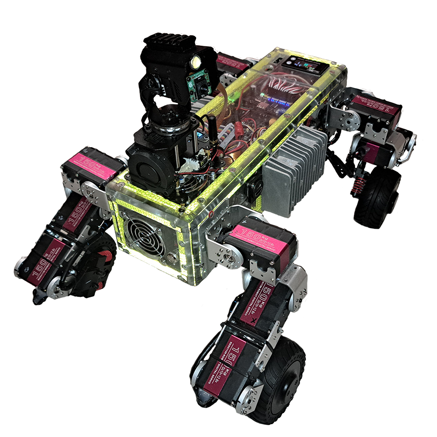

# m4rk_ugv_rpi

ugv robot raspberry pi5 camera module

## Basic Description

The UGV robots utilize both an upper computer and a lower computer. This repository contains the program running on the upper computer, which is typically a Raspberry Pi in this setup.

The upper computer communicates with the lower computer (the robot's driver based on ESP32) by sending JSON commands via GPIO UART. The host controller, which employs a Raspberry Pi, handles AI vision and strategy planning, while the sub-controller, utilizing an ESP32, manages motion control and sensor data processing. This setup ensures efficient collaboration and enhanced performance.

## Features

- Real-time video based on WebRTC
- Interactive tutorial based on JupyterLab
- Cross-platform web application base on Flask
- Auto targeting (OpenCV)
- Object Recognition (OpenCV)
- Gesture Recognition (MediaPipe)
- Face detection (OpenCV & MediaPipe)
- Motion detection (OpenCV)
- Line tracking base on vision (OpenCV)
- Color Recognition (OpenCV)
- Multi-threaded CV processing

OpenCV (Open Source Computer Vision Library) is an open source software library designed for image processing and computer vision. It provides a variety of tools and functions for working with images and videos, including filtering, object recognition, motion analysis, and more.

MediaPipe is a framework from Google that allows developers to create multimedia applications using machine learning technologies. It provides ready-made solutions for video and image processing, such as face recognition, hand tracking, pose detection, and others.

Together, OpenCV and MediaPipe can be used to create powerful computer vision and image processing applications, allowing developers to easily integrate machine learning features into their projects. For example, you can use MediaPipe to detect key points on a person's body and then process this data using OpenCV to create various effects or analyze movements.

## Quick Install

### You need to install Raspberry Pi on your robot.

[Raspberry Pi Imager](https://www.raspberrypi.com/software/)

You can use this tutorial to upgrade your robot's upper computer program.

    sudo apt update && sudo apt upgrade -y

You can use this tutorial to install this program on a pure Raspberry Pi OS.

### Download the repo from github

You can clone this repository from M4RK303 GitHub to your local machine.

### git clone

     git clone https://github.com/M4RK303/ugv_rpi_m4rk_1.git

### Go to the directory ugv_rpi

    cd ugv_rpi_m4rk_1/

### Grant execution permission to the installation script setup.sh

    sudo chmod +x setup.sh

### Grant execution permission to the installation script autorun.sh

    sudo chmod +x autorun.sh

### Install app

    sudo ./setup.sh

### Autorun setup

    ./autorun.sh

### Go to the directory AccessPopup

    cd AccessPopup

### Grant execution permission to the installation script AccessPopup

    sudo chmod +x installconfig.sh

### AccessPopup installation

    sudo ./installconfig.sh

### lection section 1 - 9

- \*Input 1: Install AccessPopup

- \*Press any key to exit

- \*Input 9: Exit installconfig.sh

### Reboot Device

    sudo reboot

After powering on the robot, the Raspberry Pi will automatically establish a hotspot, and the LED screen will display a series of system initialization messages:

- The first line `E` displays the IP address of the Ethernet port, which allows remote access to the Raspberry Pi. If it shows No Ethernet, it indicates that the Raspberry Pi is not connected to an Ethernet cable.
- The second line `W` indicates the robot's wireless mode. In Access Point (AP) mode, the robot automatically sets up a hotspot with the default IP address `192.168.50.5`. In Station (STA) mode, the Raspberry Pi connects to a known WiFi network and displays the IP address for remote access.
- The third line `F/J` specifies the Ethernet port numbers. Port `5000` provides access to the robot control Web UI, while port `8888` grants access to the JupyterLab interface.
- The fourth line `STA` indicates that the WiFi is in Station (STA) mode. The time value represents the duration of robot usage. The dBm value indicates the signal strength RSSI in STA mode.

### Control the robot on WiFi

You can access the robot web app using a mobile phone or PC. Simply open your browser and enter `[IP]:5000` (for example, `192.168.10.50:5000`) in the URL bar to control the robot.

If the robot is not connected to a known WiFi network, it will automatically set up a hotspot named "`AccessPopup`" with the password `1234567890`. You can then use a mobile phone or PC to connect to this hotspot. Once connected, open your browser and enter `192.168.50.5:5000` in the URL bar to control the robot.

### Command s

To ensure compatibility with various types of robots running on Raspberry Pi, we utilize a config.yaml file to specify the particular robot being used. You can configure the robot by entering the following command:

    s 22

In this command, the s directive denotes a robot-type setting. The first digit, `2`, signifies that the robot is a `UGV Rover`, with `1` representing `RaspRover` and `3` indicating `UGV Beast`. The second digit, also `2`, specifies the module as `Camera PT`, where `0` denotes `Nothing` and `1` signifies `RoArm-M2`.

### JupyterLab

To access JupyterLab, use `[IP]:8888` (for example, `192.168.10.50:8888`).

### v4l2.py

If the program fails to run and encounters errors related to v4l2.py during runtime, you need to delete v4l2.py from both the Python virtual environment and the user environment. This will allow the program to automatically use the system-wide v4l2.py.

    cd ugv_rpi/

    sudo rm ugv-env/lib/python3.11/site-packages/v4l2.py

    sudo rm /home/[your_user_name]/.local/lib/python3.11/site-packages/v4l2.py

Now you can restart the main program app.py.

# License

ugv_rpi for the Raspberry Pi: an open source robotics platform for the Raspberry Pi. Copyright (C) 2025 [Waveshare](https://www.waveshare.com/)

